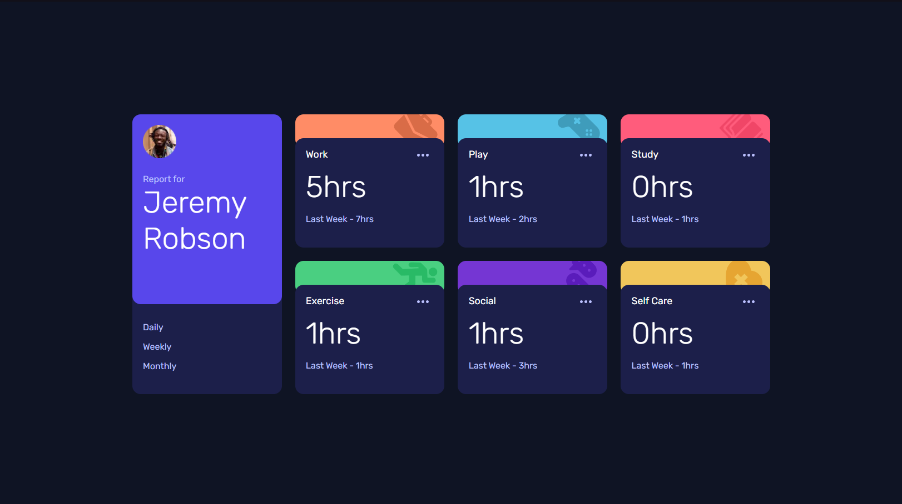
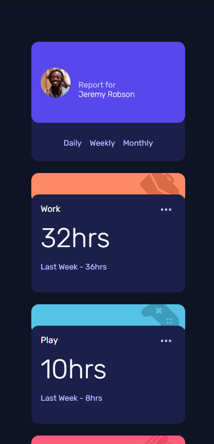

# Frontend Mentor - Time tracking dashboard solution

This is a solution to the [Time tracking dashboard challenge on Frontend Mentor](https://www.frontendmentor.io/challenges/time-tracking-dashboard-UIQ7167Jw). Frontend Mentor challenges help you improve your coding skills by building realistic projects.

## Table of contents

- [Overview](#overview)
  - [The challenge](#the-challenge)
  - [Screenshot](#screenshot)
  - [Links](#links)
- [My process](#my-process)
  - [Built with](#built-with)
  - [What I learned](#what-i-learned)
  - [Useful resources](#useful-resources)
- [Author](#author)

## Overview

### The challenge

Users should be able to:

- View the optimal layout for the site depending on their device's screen size
- See hover states for all interactive elements on the page
- Switch between viewing Daily, Weekly, and Monthly stats

### Screenshot




### Links

- Challenge URL: [Click](https://www.frontendmentor.io/challenges/time-tracking-dashboard-UIQ7167Jw/)
- Live Site URL: [Click](https://timetracker-nextjs.netlify.app)

## My process

### Built with

- Semantic HTML5 markup
- CSS custom properties
- Flexbox
- CSS Grid
- [React](https://reactjs.org/) - JS library
- [Next.js](https://nextjs.org/) - React framework
- [Styled Components](https://styled-components.com/) - For styles

### What I learned

This is a function that return Icon based on the Banner name. For example it renders IconStudy for Study Banner dynamically. If it doesn't match any Banner name it returns default IconWork.

```js
import IconWork from "../../images/icon-work.svg";
import IconExercise from "../../images/icon-exercise.svg";
import IconPlay from "../../images/icon-play.svg";
import IconSelfCare from "../../images/icon-self-care.svg";
import IconSocial from "../../images/icon-social.svg";
import IconStudy from "../../images/icon-study.svg";

const icons = [
  <IconWork key="1" tag="work" />,
  <IconExercise key="2" tag="exercise" />,
  <IconPlay key="3" tag="play" />,
  <IconSelfCare key="4" tag="selfcare" />,
  <IconSocial key="5" tag="social" />,
  <IconStudy key="6" tag="study" />,
];

export const returnIcon = (iconName: string) => {
  const icon = icons.find((item) =>
    item.props.tag.includes(iconName.split(" ").join("").toLowerCase())
  );

  if (icon) {
    return icon;
  } else {
    return <IconWork />;
  }
};
```

### Useful resources

- [Netlify](https://www.netlify.com/)
- [css-tricks](https://css-tricks.com/look-ma-no-media-queries-responsive-layouts-using-css-grid/) - Look Ma, No Media Queries! Responsive Layouts Using CSS Grid

## Author

- Website - [Sławomir Mendyka](https://www.slawomir.me)
- Frontend Mentor - [@thewilkupl](https://www.frontendmentor.io/profile/thewilkupl)
- Twitter - [@HeySlawomir](https://twitter.com/HeySlawomir)
